# Documentation Fonctionnelle de JavaPass

## Table des matières

- [Prérequis](#prérequis)
- [Installation et Mise en place](#installation-et-mise-en-place)
    - [Linux/Unix](#pour-linuxunix)
    - [Windows](#pour-windows)
- [Utilisation de JavaPass](#utilisation-de-javapass)

## Prérequis

- [JDK Java 25](https://adoptium.net/fr/temurin/releases)
- [Git 2.52.0](https://git-scm.com/install)
- [Maven 3.9.12](https://maven.apache.org/download.cgi)

Si vous n'avez pas configuré Maven, cliquez ici pour voir le [guide de configuration Maven](Tuto_Maven.md)

## Installation et Mise en place

### Pour Linux/Unix

1. Ouvrez l'invite de commandes et rendez-vous dans le répertoire où vous voulez que le dépôt soit cloné
```
cd chemin/où_je_veux/installer/JavaPass
```

2. Téléchargez le dépôt
```
git clone https://github.com/Axel-Cfr/JavaPass.git
```

3. Rendez-vous dans le répertoire racine de JavaPass
```
cd JavaPass
```

4. Nettoyez les potentiels fichiers générés par Maven, compilez et installez les fichiers du projet 
```
mvn clean install
```

5. Lancez JavaPass
```
java -jar target/JavaPass.jar
```

6. Optionnel : Vous pouvez créer un fichier JavaPass.sh cliquable :
```
# Création du fichier .sh dans le bureau
nano ~/Bureau/JavaPass.sh
```
```
# À copier dans le fichier .sh
#!/bin/bash
cd ~/home/votre_user/chemin/vers/JavaPass
java -jar target/JavaPass.jar
```
```
# Le rendre executable
chmod +x ~/Bureau/JavaPass.sh
```
**Attention**, il est possible que vous ayez à activer : ``"executer dans le terminal"``, via les paramètres avancés du fichier.

### Pour Windows

1. Ouvrez l'invite de commandes et rendez-vous dans le répertoire où vous voulez que le dépôt soit cloné
```
cd chemin/où_je_veux/installer/JavaPass
```

2. Téléchargez le dépôt
```
git clone https://github.com/Axel-Cfr/JavaPass.git
```

3. Rendez-vous dans le répertoire racine de JavaPass
```
cd JavaPass
```

4. Nettoyez les potentiels fichiers générés par Maven, compilez et installez les fichiers du projet 
```
mvn clean install
```

5. Indiquez à la console d'afficher les caractères avec l'encodage UTF-8 (sinon certains caractères spéciaux s'afficheront mal).
```
C:/Windows/System32/chcp.com 65001
```

6. Lancez JavaPass
```
java -jar target/JavaPass.jar
```

7. Optionnel : Vous pouvez créer un fichier JavaPass.bat cliquable en y écrivant ceci dans un fichier texte et en l'enregistrant sous forme de fichier .bat :
```
C:/Windows/System32/chcp.com 65001
cd C:/Users/votre_user/chemin/vers/JavaPass
java -jar target/JavaPass.jar
```

8. Optionnel : Vous pouvez créer un raccourci de JavaPass.bat et lui attribuer l'icône de JavaPass. Le fichier Javapass.ico se trouve dans `C:/Users/votre_user/chemin/vers/JavaPass/docs/img`.

**Attention**, si vous lancez JavaPass depuis un IDE sans passer par le .jar, veillez à exécuter `C:\Windows\System32\chcp.com 65001` avant. Autrement, certains caractères spéciaux s'afficheront mal.

## Utilisation de Javapass

Une fois l'application lancée, suivez les indications affichées à l'écran. Voici les fonctions principales :

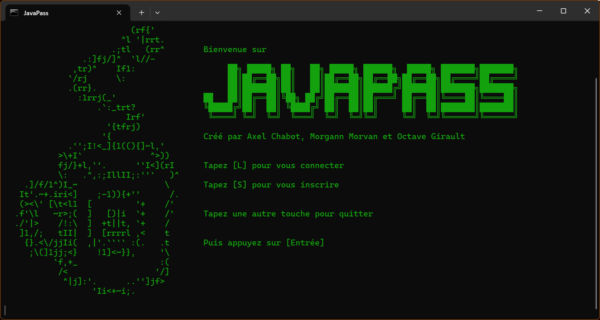

### 1. Inscription et Connexion
Au lancement, l'écran de bienvenue s'affiche :
- Tapez **[S]** pour créer un compte. **Attention :** Ne perdez surtout pas votre mot de passe maître, c'est la clé de votre coffre-fort !

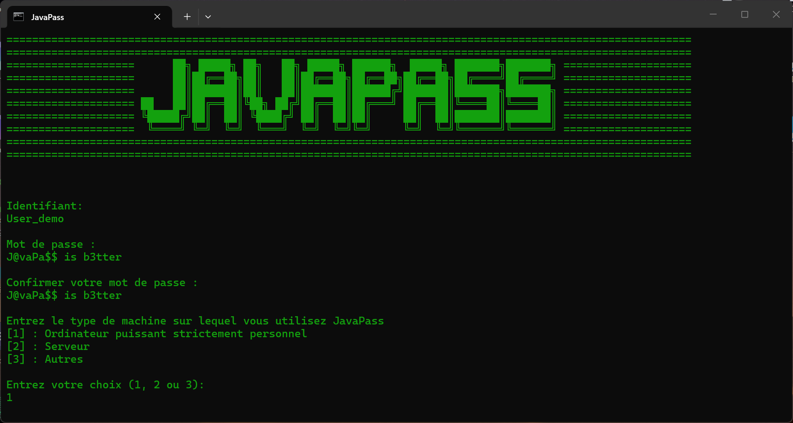

- Tapez **[L]** pour vous connecter à un compte existant.

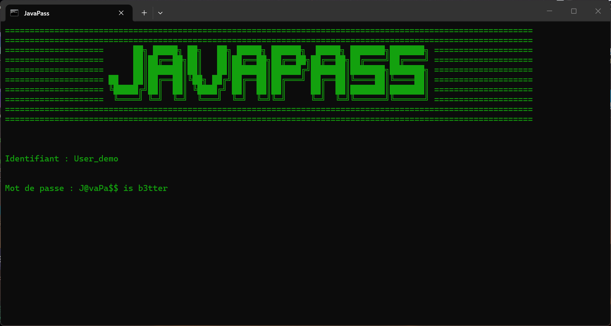

### 2. Le menu d'accueil
Une fois connecté(e), tapez simplement le numéro de l'action souhaitée puis "Entrée" :
- **[1]** Consulter et gérer vos mots de passe enregistrés.
- **[2]** Ajouter un nouveau mot de passe.
- **[3]** Modifier votre mot de passe maître.
- **[4]** Supprimer définitivement votre compte.
- **[5]** Quitter l'application.

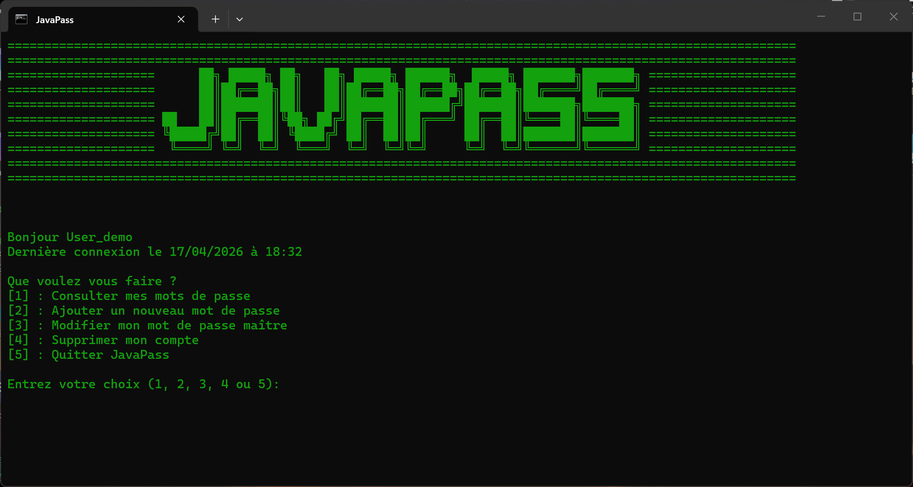

### 3. Modifier son mot de passe maitre
Avec l'option **[3]**, vous êtes invité à définir  un nouveau mot de passe.

**mettre image axel modifier mot de passe maitre**

### 4. Ajouter un nouveau mot de passe
Avec l'option **[2]**, enregistrez les identifiants d'un nouveau site (nom, URL, identifiant).
Pour le mot de passe, vous avez le choix :
- Le taper vous-même.
- Laisser JavaPass en **générer un automatiquement**.

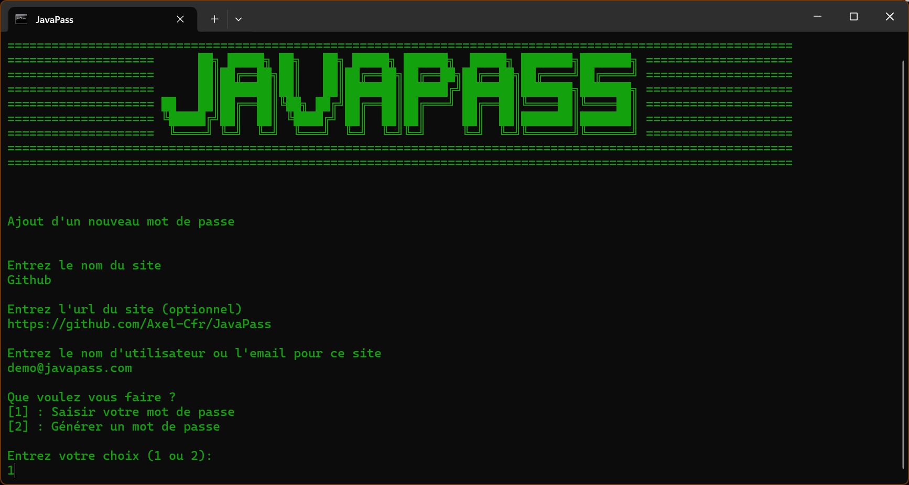

### 5. Consulter et rechercher
Avec l'option **[1]**, JavaPass liste vos sites enregistrés :
- Tapez le **numéro** d'un site pour en voir les détails.

    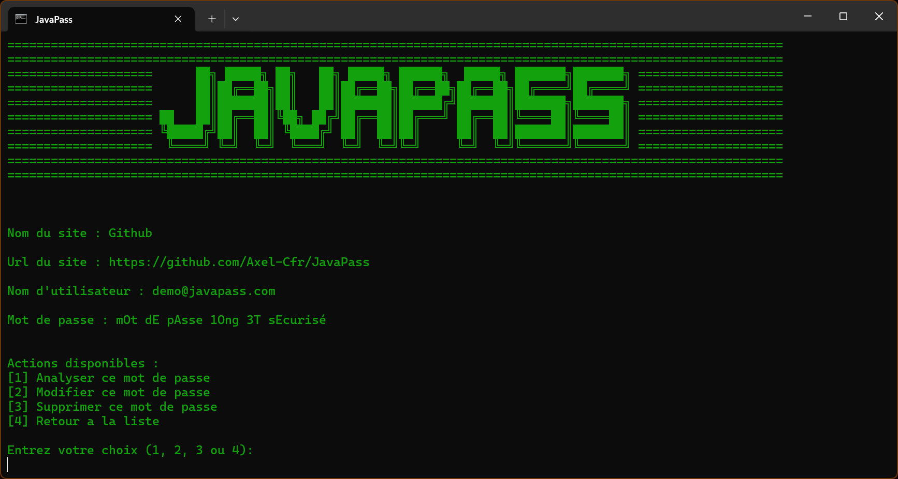

- Recherchez un site précis en tapant `s*` suivi du nom (ex: `s*google`). La recherche, résistante à la casse, affichera tous les sites contenant votre recherche.
    - Avant recherche :
    
    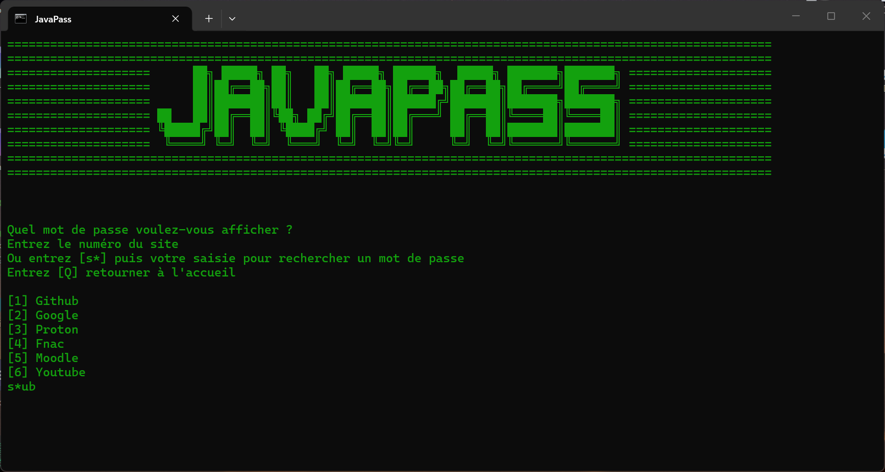

    - Après recherche :

    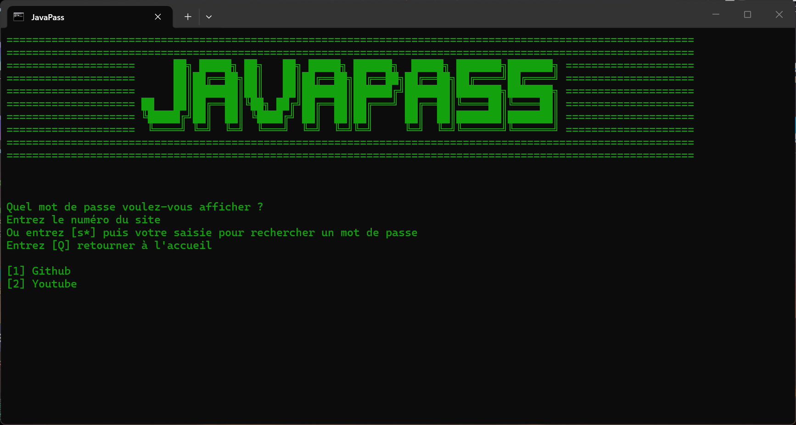

    - **Astuce** : Pour faire en sorte que tous vos mots de passe s'affichent après une recherche, entrez seulement `s*`

- Tapez **[Q]** pour revenir à l'accueil.

### 6. Gérer un mot de passe
En consultant les détails d'un mot de passe, plusieurs actions s'offrent à vous :
- **[1] Analyser :** Vérifie la robustesse du mot de passe et son temps de piratage estimé, alerte l'utilisateur en cas de réutilisation sur d'autres sites et propose de l'améliorer s'il est jugé trop faible.
    - Cas d'un mot de passe fort :

    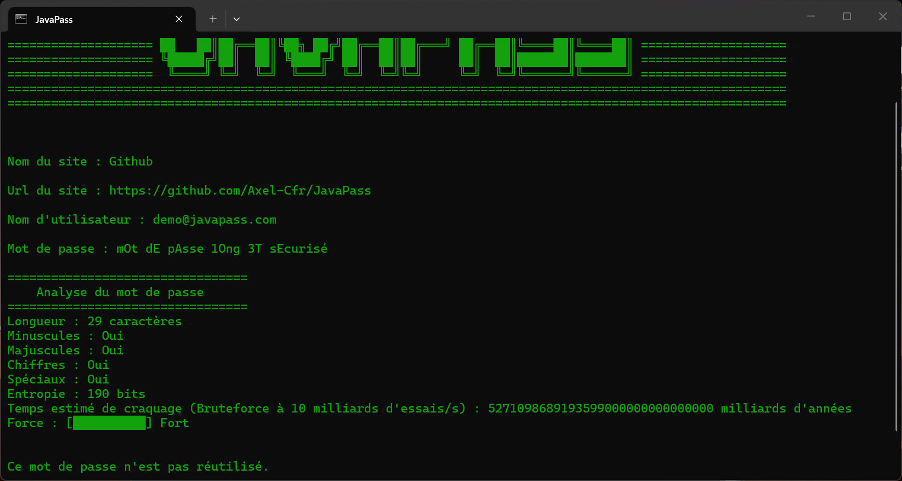

    - Cas d'un mot de passe faible :

    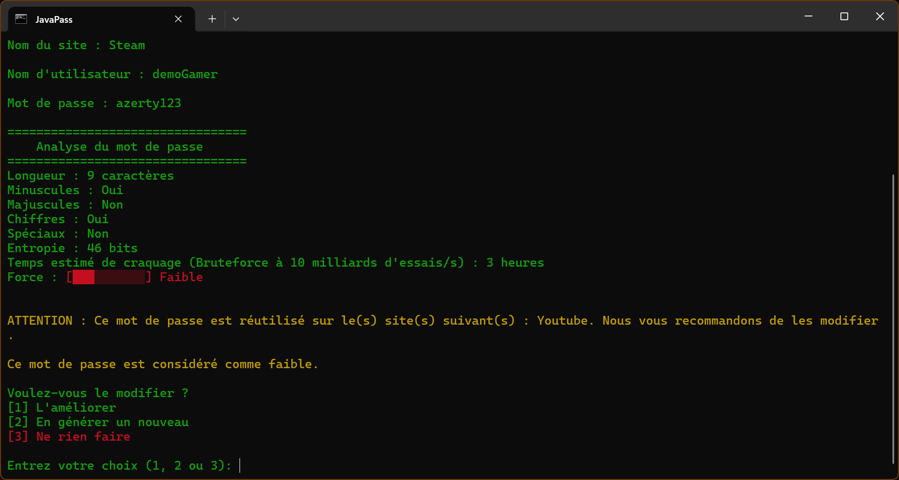
- **[2] Modifier :** Remplace l'ancien mot de passe par un nouveau.
- **[3] Supprimer :** Efface complètement ce mot de passe.
- **[4] Retour :** Revient à la liste des sites.

### 6. Modifier son mot de passe maître
Après une demande de confirmation, votre mot de passe maître actuel est demandé par mesure de sécurité. Vous n'avez qu'à saisir votre nouveau mot de passe maître.

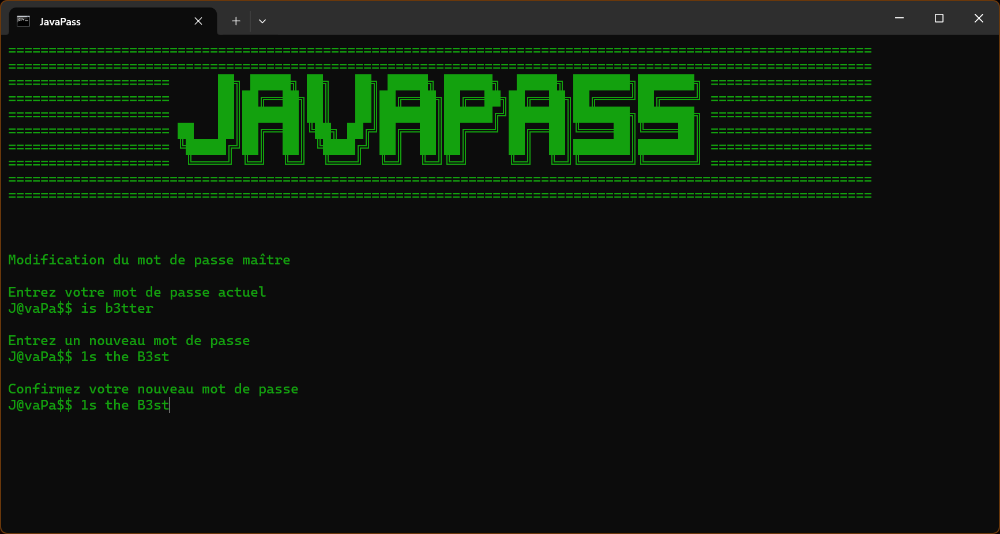