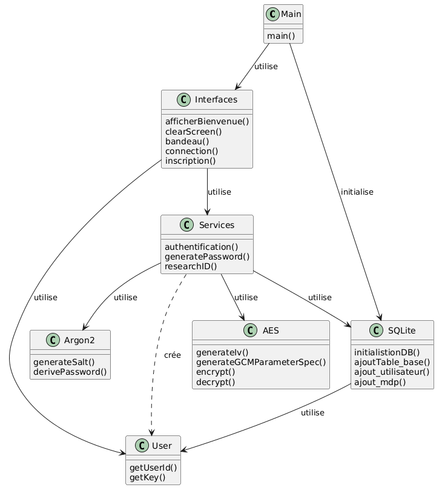
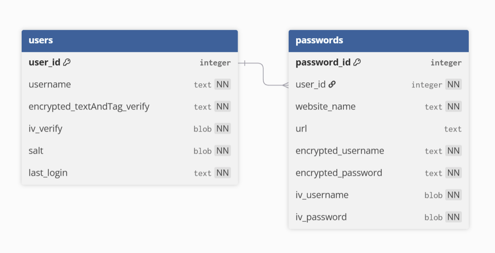

# Documentation Technique de JavaPass

## Table des matières

- [Architecture](#architecture)
- [Sécurité](#sécurité)
    - [Chiffrement](#chiffrement)
    - [Hachage](#hachage)
    - [Bonnes pratiques](#bonnes-pratiques)
- [Base de données](#base-de-données)
- [Fonctionnalités](#fonctionnalités)
- [Gestion des Dépendances](#gestion-des-dépendances)
- [Source]()

## Architecture

Ce projet possède une architecture en couches qui se distingue en 3 couches :
- Interface utilisateur : gérée par la classe `Interface`, responsable de l'affichage et les interactions avec utilisateur
- Logique métier : gérée par la classe `Services`, qui assure les différentes fonctionnalités du gestionnaire de mot de passe, délègue le chiffrement à la classe `AES`, le hachage à `Argon2`, la communication avec la base de données à `SQLite`, instancie et utilise un objet de la classe `User` et gère les erreurs (sauf les erreurs de scanners qui sont gérées par `Interface`)
- Base de données : gérée par la classe `SQLite`, qui communique avec la base de donnée et renvoie les informations demandées

La classe Main instancie un objet de la classe `Services` et un de la classe `Interface`  

L'architecture en couches est une architecture très classique pour créer des applications de bureaux. Elle permet de séparer les responsabilités; chaque couche ne peut communiquer qu'avec celle qui se trouve directement en dessous. Cela assure une certaine évolutivité et la lisibilité du code tout en restant une architecture adaptée à un projet académique (utiliser des architectures plus complexes ne serait d'aucune utilité dans ce cas de figure).

## Sécurité

### Hachage

### Chiffrement

L'algorithme de chiffrement utilisé dans JavaPass est l'AES-256-GCM.

L'AES, pour Advanced Encryption Standard, est un algorithme de chiffrement symétrique, c'est à dire un algorithme qui peut chiffrer et déchiffrer des données à partir d'un même mot de passe.  
AES est recommandé et adopté par le NIST (National Institute of Standards and Technologies) depuis 2001 et approuvé par la NSA.  
C'est l'algorithme de chiffrement le plus utilisé au monde et l'un des plus robuste. En effet avec une clé de 256 bits (longueur utilisée pour JavaPass), il existe 2256 clés possibles. Même pour le superclaculateur le plus puissant du monde qui peut atteindre un peu moins de 3 milliards de milliards de calculs par seconde, il faudrait environ 1,2×1051 années pour tester toute les clés possibles, soit 8,6×1040 fois l'âge de l'univers.

- Comment marche AES ?

### Bonnes pratiques

## Base de données

La classe `SQLite` contient plusieurs méthodes permettant d'envoyer et de récupérer de façon sécurisée les données utilisateurs via notre base de données relationnelle.

Elle utilise l'API `JDBC` qui permet de se conneter à une base données et d'interagir avec elle, notamment en exécutant des rêquetes SQL du type :
 - CREATE TABLE ...
 - INSERT INTO ... VALUES ...
 - SELECT ... FROM ...
 - DELETE ... FROM ...
 - UPDATE ... SET ...

`L'achitecture de la Base de données` est simple, mais elle fourni un niveau de sécurité suffisant pour décourager <u>**quiconque**</u> d'essayer de déchiffrer ses données ([voir Chiffrement](#chiffrement)).

Elle est organisée en deux tables : 
- `users` : qui stocke un id (clé primaire), un nom d'utilisateur, les données nécessaires au chiffrement et déchiffrement, ainsi que la date de dernières
- `passwords` : qui 

## Fonctionnalités

- **`generatePassword`** : Génère un mot de passe aléatoire et robuste en fonction de critères définis (longueur, majuscules, chiffres et caractères spéciaux).
- **`check`** : Permet de vérifier si un mot de passe respecte bien certains critères.
- **`enhancePassword`** : Améliore un mot de passe jugé trop faible en le complexifiant (par exemple, en ajoutant des caractères manquants ou en augmentant sa longueur) pour atteindre un niveau de sécurité convenable, tout en gardant la base.
- **`analysePassword`** : Évalue la force d'un mot de passe (calcul d'entropie), calcule une estimation de durée de craquage par bruteforce et retourne un rapport détaillé. 
- **`convertirDuree`** : Méthode interne servant à transformer un grand nombre de secondes en une unité plus lisible (secondes, jours, années, siècles, etc.).
- **`estFaible`** : Retourne un booléen évaluant si le mot de passe est considéré comme faible ou non.
- **`samePassword`** : Vérifie dans la base de données si le mot de passe fourni est déjà réutilisé pour d'autres sites.

## Gestion des dépendances

## Sources

- Architecture
    - https://www.redhat.com/fr/topics/cloud-native-apps/what-is-an-application-architecture
- AES
    - https://www.youtube.com/watch?v=5ZEYKk8BHcE
    - https://www.developpez.net/forums/blogs/863457-autran/b1016/chiffrement-aes-java/
    - https://www.remipoignon.fr/aes-le-big-boss-du-chiffrement-symetrique/
    - https://owasp.org/www-community/Using_the_Java_Cryptographic_Extensions
    - https://jmdoudoux.developpez.com/cours/developpons/java/chap-jce.php
    - https://www.baeldung.com/java-aes-encryption-decryption
    - https://fr.wikipedia.org/wiki/Advanced_Encryption_Standard
- Argon2
    - https://www.baeldung.com/java-argon2-hashing
    - https://www.rfc-editor.org/rfc/rfc9106.html
    - https://argon2-cffi.readthedocs.io/en/stable/api.html
    - https://argon2-cffi.readthedocs.io/en/stable/parameters.html
    - https://cheatsheetseries.owasp.org/cheatsheets/Password_Storage_Cheat_Sheet.html
    - https://app.itsasync.fr/post/async-article-1010
    - https://tuta.com/fr/blog/best-encryption-with-kdf
- Robustesse d'un mot de passe
    - https://proton.me/fr/blog/what-is-password-entropy
- SQLite pour Java
    - https://www.youtube.com/watch?v=TN_xTjbrzzc
    - https://sqlite.org/docs.html
    - https://sqlite.fr/languages/java/
    - https://www.sqlitetutorial.net/sqlite-java/jdbc-read-write-blob/
    - https://sqlite.org/datatype3.html
    - https://github.com/xerial/sqlite-jdbc/blob/master/USAGE.md
    - https://www.datacamp.com/fr/tutorial/sqlite-data-types
    - https://sqlite.org/foreignkeys.html
    - https://stackoverflow.com/questions/457629/how-to-return-multiple-objects-from-a-java-method
- Maven
    - https://maven.apache.org/download.cgi
    - https://www.youtube.com/watch?v=Aaq3FaadNQo
    - https://objis.com/tutoriel-maven-n1-installation-et-phases/
    - https://www.baeldung.com/executable-jar-with-maven
    - https://maven.apache.org/plugins/maven-jar-plugin/jar-mojo.html
    - https://maven.apache.org/plugins/maven-assembly-plugin/single-mojo.html
- Encodage
    - https://docs.oracle.com/en/java/javase/25/docs/api/java.base/java/util/Scanner.html#%3Cinit%3E(java.io.InputStream,java.lang.String)
    - https://medium.com/@andbin/jdk-18-and-the-utf-8-as-default-charset-8451df737f90
    - https://northcoder.com/post/java-console-output-with-utf-8/
