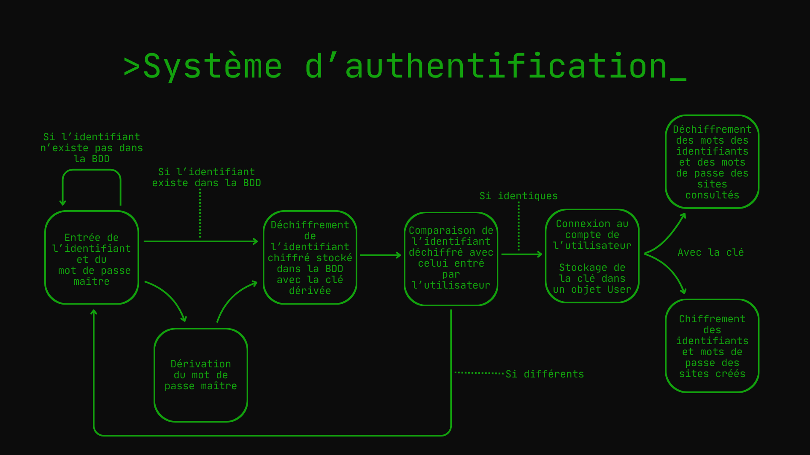

# Documentation Technique de JavaPass

## Table des matières

- [Architecture](#architecture)
- [Liste des principales fonctions](#liste-des-principales-fonctions)
    - [Interface](#interfacejava)
    - [Services](#servicesjava)
    - [Argon2](#argon2java)
    - [AES](#aesjava)
    - [User](#userjava)
    - [InactivityCounter](#inactivitycounterjava)
    - [SQLite](#sqlitejava)
- [Sécurité](#sécurité)
    - [Hachage](#hachage)
    - [Chiffrement](#chiffrement)
    - [Authentification et utilisation de la clé dérivée](#authentification-et-utilisation-de-la-clé-dérivée)
    - [Détection d'inactivité](#détection-dinactivité)
- [Base de données](#base-de-données)
    - [Architecture](#architecture-de-la-base-de-données)
    - [Protection contre les injections SQL](#Protection-contre-les-injections-SQL)
- [Gestion des Dépendances](#gestion-des-dépendances)
- [Utilisation de l'Intelligence Artificielle](#utilisation-de-lintelligence-artificielle)
- [Sources](#sources)

## Architecture


Ce projet possède une architecture en couches qui se distingue en 3 couches :
- Interface utilisateur : gérée par la classe `Interface`, responsable de l'affichage et des interactions avec l'utilisateur
- Logique métier : gérée par la classe `Services`, qui assure les différentes fonctionnalités du gestionnaire de mots de passe, délègue le chiffrement à la classe `AES`, le hachage à `Argon2`, la communication avec la base de données à `SQLite`, instancie et utilise un objet de la classe `User` et gère les erreurs (sauf les erreurs de scanners qui sont gérées par `Interface`). `Services` instancie aussi un objet de la classe `InactivityCounter` qui ferme l'application au bout de 5 min sans saisie de la part de l'utilisateur
- Base de données : gérée par la classe `SQLite`, qui communique avec la base de données et renvoie les informations demandées

La classe Main instancie un objet de la classe `Services` et un de la classe `Interface`  

L'architecture en couches est une architecture très classique pour créer des applications de bureau. Elle permet de séparer les responsabilités; chaque couche ne peut communiquer qu'avec celle qui se trouve directement en dessous. Cela assure une certaine évolutivité et la lisibilité du code tout en restant une architecture adaptée à un projet académique (utiliser des architectures plus complexes ne serait d'aucune utilité dans ce cas de figure).

## Liste des fonctions principales

Le nom de chaque fonction présentée est cliquable et vous redirige vers le **code largement commentée** de celle-ci.

### Interface.java

- [**`givePasswordInfos`**](../src/main/java/javapass/Interface.java#L32) : Donne les informations du password.
- [**`quit`**](../src/main/java/javapass/Interface.java#L98) : Quitte proprement l'application JavaPass.
- [**`clearScreen`**](../src/main/java/javapass/Interface.java#L105) : Réinitialise l'affichage console.
- [**`bandeau`**](../src/main/java/javapass/Interface.java#L118) : Affichage du bandeau de JavaPass.
- [**`erreur`**](../src/main/java/javapass/Interface.java#L138) : Affichage des messages d'erreur.
- [**`accueil`**](../src/main/java/javapass/Interface.java#L250) : Affichage de l'acceuil.
- [**`voirMDP`**](../src/main/java/javapass/Interface.java#L379) : Permet de voir tous les mots de passe d'un utilisateur.
- [**`analyserMDP`**](../src/main/java/javapass/Interface.java#L490) : Analyse un mot de passe et donne des informations sur son entropie, son temps estimé de craquage par un super-ordinateur ainsi que sa force.

### Services.java
- [**`authentification`**](../src/main/java/javapass/Services.java#L47) : Vérifie que les identifiants entrés sont valides et appartiennent à un compte afin de récupérer les données du compte et de se connecter à l'application.
- [**`inscription`**](../src/main/java/javapass/Services.java#L91) : Créé un compte et l'inscrit dans la base de données.
- [**`givePasswordInfos`**](../src/main/java/javapass/Services.java#L212) : Donne les informations du password.
- [**`updateMasterPassword`**](../src/main/java/javapass/Services.java#L342) : prend en charge la mise à jour du mot de passe maître et ses conséquences (dechiffrer toutes les données cryptées avec l'ancienne clé et les anciens IVs puis les rechiffer avec la bonne clé et de nouveaux IVs)

- [**`generatePassword`**](../src/main/java/javapass/Services.java#L446) : Génère un mot de passe aléatoire et robuste en fonction de critères définis (longueur, majuscules, chiffres et caractères spéciaux).
- [**`check`**](../src/main/java/javapass/Services.java#L501) : Permet de vérifier si un mot de passe contient des minucules, des majuscules, des chiffres et des caractères spéciaux.
- [**`enhancePassword`**](../src/main/java/javapass/Services.java#L521) : Améliore un mot de passe jugé trop faible en le complexifiant (par exemple, en ajoutant des caractères manquants ou en augmentant sa longueur) pour atteindre un niveau de sécurité convenable, tout en gardant la base.
- [**`analysePassword`**](../src/main/java/javapass/Services.java#L549) : Évalue la force d'un mot de passe (calcul d'entropie), calcule une estimation de durée de craquage par bruteforce et renvoie un rapport détaillé. 
- [**`convertirDuree`**](../src/main/java/javapass/Services.java#L652) : Méthode interne servant à transformer un grand nombre de secondes en une unité plus lisible (secondes, jours, années, siècles, etc.).
- [**`estFaible`**](../src/main/java/javapass/Services.java#L678) : Retourne un booléen en évaluant si le mot de passe est considéré comme faible ou non.
- [**`samePassword`**](../src/main/java/javapass/Services.java#L690) : Vérifie dans la base de données si le mot de passe fourni est déjà utilisé pour d'autres sites.
- [**`wait`**](../src/main/java/javapass/Services.java#L717) : Met le programme en pause avec `duree` en millisecondes passée en argument.

### Argon2.java
- [**`generateSalt`**](../src/main/java/javapass/Argon2.java#L11) : Génère et retourne un sel de 16 octets (= 128bits)
- [**`derivePassword`**](../src/main/java/javapass/Argon2.java#L22) : Dérive le mot de passe passé en paramètre

### AES.java
- [**`generateIV`**](../src/main/java/javapass/AES.java#L12) : Crée un vecteur d'initialisation aléatoire (12 octets)
- [**`generateGCMParameterSpec`**](../src/main/java/javapass/AES.java#L22) : Crée un objet GCMParameterSpec (128bits = 16 octets) avec un iv (12 octets) et un tag d'authentification propre à GCM (4 octets)
- [**`encrypt`**](../src/main/java/javapass/AES.java#L28) : Chiffre une chaîne de caractère et la retourne une fois chiffrée
- [**`decrypt`**](../src/main/java/javapass/AES.java#L40) : Dechiffre une chaîne de caractère chiffrée et la retourne une fois dechiffrée

### User.java
- [**`get...`**](../src/main/java/javapass/User.java#L24) : `User.java` contient un certain nombre de getters permettant de récupérer efficacement les données d'un utilisateur.

### InactivityCounter.java
- [**`start`**](../src/main/java/javapass/InactivityCounter.java#L17) : Initialise le compteur d'inactivité.
- [**`resetTimer`**](../src/main/java/javapass/InactivityCounter.java#L22) : est appelée à chaque intéraction de l'utilisateur pour réinitialiser le compteur d'inactivité.

### SQLite.java
- [**`initialisationDB`**](../src/main/java/javapass/SQLite.java#L39) : Établis la connexion avec la base de données et lui ajoute les tables users et passwords si elles n'existent pas. 
- [**`ajoutTable_base`**](../src/main/java/javapass/SQLite.java#L58) : Cette méthode permet d'ajouter les tables de base à la base de données seulement si celles-ci n'existent pas encore elle est utilisé dans l'initialisation de l'application.
- [**`deconnexion`**](../src/main/java/javapass/SQLite.java#L98) : Cette méthode ferme la connexion avec la base de données.
- [**`ajout_utilisateur`**](../src/main/java/javapass/SQLite.java#L112) : Cette méthode ajoute un utilisateur dans la table users.
- [**`ajout_mdp`**](../src/main/java/javapass/SQLite.java#L143) : Cette méthode ajoute un mot de passe dans la table passwords.
- [**`suppr_utilisateur`**](../src/main/java/javapass/SQLite.java#L363) : Cette méthode permet de supprimer un utilisateur via son username.
- [**`suppr_mdp`**](../src/main/java/javapass/SQLite.java#L378) : Cette méthode permet de supprimer le mot de passe d'un site renseigné via son website_name et le user_id.

## Sécurité

### Hachage

La fonction de dérivation utilisée dans JavaPass est **Argon2**.

Argon2 est une fonction de dérivation recommandé par l'OWASP (Open Worldwide Application Security Project) et vainqueur du Password Hashing Competition de 2015. Une fonction de dérivation permet d'obtenir une suite de caractères pseudo-aléatoire ou d'étirer une clé afin qu'elle corresponde aux standards d'une clé de chiffrement. Dans notre cas, nous étirons le mot de passe maître afin qu'il serve de clé pour l'algorithme de chiffrement implémenté.


#### Pourquoi Argon2 ?

Nous avons choisi d'utiliser Argon2 car il est volontairement lent et coûteux en ressources matérielles, ce qui le rend beaucoup plus résistant aux attaques par force brute que la plupart des autres fonctions telles que PBKDF2 ou bcrypt (moins résistante au attaques par GPU ou ASIC).  
Il nécessite un sel aléatoire en plus de la donnée à hacher afin de limiter les attaques par rainbow table (table de hashes précalculée).  
Il est très flexible avec trois variantes différentes en fonction de la situation et des paramètres mémoires configurables.  
- **Argon2d**, conçue pour résister aux attaques par GPU/ASIC
- **Argon2i**, conçue pour résister aux attaques par canaux auxiliaires
- **Argon2id**, est un mélange des deux premiers, conçue pour résister aux attaques par GPU/ASIC et par canaux axiliaires, mais qui est légèrement moins résistant qu'Argon2d pour les attaques par GPU/ASIC et légèrement moins résistant qu'Argon2i pour les attaques par canaux auxiliaires. C'est l'option **recommandée par défaut**  

#### Utilisation dans JavaPass

Lors de la création d'un compte, il est demandé sur quel type d'appareil est utilisé JavaPass.  
Si c'est un pc puissant et strictement personnel, la variante **Argon2d** avec les paramètres de la norme RFC_9106_HIGH_MEMORY sera appliquée, garantissant une sécurité maximale contre les attaques par GPU/ASIC.  
Si c'est un serveur, la variante **Argon2id** avec des paramètres des paramètres au-dessus de la norme RFC_9106_LOW_MEMORY sera appliquée (sauf au niveau du parallélisme afin de ne pas monopoliser les threads du serveur en cas de connexions simultanées), garantissant une protection équilibrée contre les attaques par GPU/ASIC et par canaux auxiliaires tout en préservant les ressources du serveur.  
Si l'option par défaut est choisie, la variante **Argon2id** avec des paramètres au-dessus de la norme RFC_9106_LOW_MEMORY sera appliquée, garantissant une protection équilibrée contre les attaques par GPU/ASIC et par canaux auxiliaires tout en préservant les ressources du la machine.  

| | RFC_9106 HIGH_MEMORY | RFC_9106 LOW_MEMORY | PC puissant et strictement personnel | Serveur | Autres |
|:---: |:---:|:---:|:---:|:---:|:---:|
Itérations | 1 | 4 | 1 | 2 | 4 |
Coût mémoire | 2 Gio (= 2.14 Go) | 64 mio (= 67 mo) | 2 Gio | 128 mio | 128 mio |
Parallélisme | 4 | 4 | 4 | 2 | 4 |
Longueur du sel | 128 bits | 128 bits | 128 bits | 128 bits | 128 bits |
Longueur du hash | 256 bits | 256 bits | 256 bits | 256 bits | 256 bits |  

Nous utilisons la bibliothèque BouncyCastle bcprov-jdk18on version 1.83 dans JavaPass.

Pour en savoir plus, vous pouvez visualiser le code du fichier [Argon2.java](../src/main/java/javapass/Argon2.java).

### Chiffrement

L'algorithme de chiffrement utilisé dans JavaPass est l'**AES-256-GCM**.

L'AES, pour Advanced Encryption Standard, est un algorithme de chiffrement symétrique, c'est à dire un algorithme qui peut chiffrer et déchiffrer des données à partir d'un même mot de passe.  
AES est recommandé et adopté par le NIST (National Institute of Standards and Technologies) depuis 2001 et approuvé par la NSA.  
C'est l'algorithme de chiffrement le plus utilisé au monde et l'un des plus robuste. En effet, à partir d'une clé de 256 bits (longueur utilisée pour JavaPass) il existe 2<sup>256</sup> clés possibles. Même pour le supercalculateur le plus puissant du monde qui peut atteindre un peu moins de 3 milliards de milliards de calculs par seconde, il faudrait environ 1,2×10<sup>51</sup> années pour tester toute les clés possibles, soit 8,6×10<sup>40</sup> fois l'âge de l'univers.

#### Comment marche AES ?


#### Pourquoi AES-GCM ?

Voici les différents modes d'AES :

- **AES-ECB** : Les données en clair sont divisées en blocs de 128 bits, puis chacun des blocs est chiffré avec la même clé. Donc des blocs en clair identiques donneront des blocs chiffrés identiques. Il est nécessaire que chaque bloc fasse exactement 128 bits; si un bloc est trop court, on lui ajoute des bits arbitraires.  
Vulnérabilités :
    - Pas d'IV, possibilité pour l'attaquant de répérer des motifs dans les données chiffrées ou de se servir de rainbow tables
    - Remplissage des blocs nécessaires, possibilités pour l'attaquant de déduire la taille des données ou déchiffrer le dernier bloc par attaque padding oracle
    - Pas de tag d'authetification integré, aucune indication si les données chiffrées ont été modifiées ou corrompues

- **AES-CBC** : Les données en clair sont divisées en blocs de 128 bits, puis le premier bloc est XORé avec un vecteur d'initialisation (IV) aléatoire de 128 bits. Le résulat est ensuite chiffré avec la clé. Ce premier bloc crypté est XORé avec le deuxième bloc en clair, puis le résultat est chiffré avec la clé. Les blocs nécessitent un remplissage si ils ne font pas exactement 128 bits.  
Vulnérabilités :
    - Remplissage des blocs nécessaires, possibilités pour l'attaquant de déduire la taille des données ou déchiffrer le dernier bloc par attaque padding oracle
    - Si l'IV est réutilisé pour chiffrer d'autres données, l'attaquant peut déduire des informations sur le texte en clair
    - Pas de tag d'authentification integré, aucune indication si les données chiffrées ont été modifiées ou corrompues

- **AES-CFB** : Mode similaire à CBC, mais il transforme AES en chiffrement par flux. Le bloc chiffré précédent (ou l'IV pour le premier bloc) est chiffré avec la clé, puis le résultat est XORé avec le bloc en clair pour produire le bloc chiffré. Vu que le chiffrement est par flux, les blocs ne nécessitent pas de remplissage.  
Vulnérabilités :
    - Si l'IV est réutilisé pour chiffrer d'autres données, l'attaquant peut déduire des informations sur le texte en clair
    - Pas de tag d'authentification integré, aucune indication si les données chiffrées ont été modifiées ou corrompues

- **AES-OFB** : L'IV est chiffré avec la clé pour produire un premier bloc chiffreur, qui est XORé avec le bloc en clair. Ce bloc chiffreur est ensuite chiffré une deuxième fois pour être Xoré au deuxième bloc en clair. Il s'agit aussi d'un chiffrement par flux.  
Vulnérabilités :
    - Si l'IV est réutilisé pour chiffrer d'autres données, l'attaquant peut déduire des informations sur le texte en clair
    - Pas de tag d'authentification integré, aucune indication si les données chiffrées ont été modifiées ou corrompues

- **AES-CTR** : Un compteur de 32 bits combiné à un sel de 96bits est chiffré avec la clé pour générer un bloc chiffreur. Celui-ci est ensuite XORé avec un bloc de données en clair. Le compteur est incrémenté pour chaque bloc, ce qui permet le chiffrement et déchiffrement parallèles. Il s'agit aussi d'un chiffrement par flux.   
Vulnérabilités :
    - Si l'IV est réutilisé pour chiffrer d'autres données, l'attaquant peut déduire des informations sur le texte en clair
    - Pas de tag d'authentification integré, aucune indication si les données chiffrées ont été modifiées ou corrompues

- **AES-GCM** : Il fonctionne exactement comme AES-CTR. En parallèle, un tag d'authentification est calculé sur les données chiffrées et les données associées. Si le tag ne correspond pas (si les données ont été altérées), une erreur est renvoyée vant même le déchiffrement. Il s'agit aussi d'un chiffrement par flux.   
Vulnérabilités :
    - Si l'IV est réutilisé pour chiffrer d'autres données, l'attaquant peut déduire des informations sur le texte en clair

#### Utilisation d'AES-256-GCM dans JavaPass

Pour en savoir plus, vous pouvez visualiser le code du fichier [AES.java](../src/main/java/javapass/AES.java).

### Authentification et utilisation de la clé dérivée



### Détection d'inactivité
 
#### Approche retenue : Thread 
 
Deux threads tournent en parallèle pendant la session active :
 
- **Thread principal** : lit les entrées utilisateur via `Scanner` et met à jour le timestamp à chaque saisie
- **Thread watchdog** : via la classe `InactivityCounter`, il vérifie toutes les secondes le temps écoulé depuis la dernière activité et déclenche le verrouillage si le délai est dépassé

##### Points importants

- Le watchdog est déclaré en `setDaemon(true)` — il s'arrête automatiquement avec le thread principal
- Le watchdog est démarré **uniquement après authentification réussie**, pas avant
#### Limite connue
 
`scanner.nextLine()` est bloquant car il ne rend la main qu'à la pression d'Entrée. Si l'utilisateur tape des caractères sans valider, le watchdog peut déclencher le verrou avant que la saisie soit terminée. Pour `JavaPass`, ce n'est pas un véritable problème.

### Détection réutilisation d'un mot de passe
`JavaPass` fourni aux utilisateurs une protection **anti-effet Domino / anti flemmard** suggerant à toutes utilisateur de ne surtout pas réuitiliser plusieurs fois le même mot de passe, une fois celui-ci analysé ([voir samePassword dans Fonctionnalités](#fonctionnalités)).


## Base de données

La classe `SQLite` contient plusieurs méthodes permettant d'envoyer et de récupérer de façon sécurisée les données utilisateurs via notre base de données relationnelle.

Elle utilise l'API `JDBC` qui permet de se conneter à une base données et d'interagir avec elle, notamment en exécutant des rêquetes SQL du type :
- CREATE TABLE ...
- INSERT INTO ... VALUES ...
- SELECT ... FROM ...
- DELETE ... FROM ...
- UPDATE ... SET ...

**Remarque** : 
- Veuillez noter qu'il est important d'activer les **foreign keys** car par défaut, SQLite désactive cette fonctionnalité pour des raisons de rétro-compatibilité; sans cette commande, les relations entre tables sont ignorées et les violations de référence (comme l'insertion de données orphelines) ne génèrent pas d'erreurs. D'où l'utilisation de la commande ```PRAGMA foreign_keys = ON``` permettant d'activer l'application des contraintes de clés étrangères pour la connexion de base de données en cours.

- Pour des mesures de sécurité encore plus poussées, l'utilisation de l'instruction SQL ```PRAGMA secure_delete = ON;``` force l'effacement sécurisé des données en écrasant le contenu supprimé avec des zéros, empêchant ainsi la récupération forensic des anciennes informations.

### Architecture de la base de données


`L'architecture de la base de données` est simple, mais elle fournit un niveau de sécurité suffisant pour décourager <u>**quiconque**</u> d'essayer de déchiffrer ses données ([voir Chiffrement](#chiffrement)).

Elle est organisée en deux tables : 
- `users` : qui stocke un id (clé primaire), un nom d'utilisateur, les données nécessaires au chiffrement et déchiffrement, ainsi que la date de la dernière connexion.

- `passwords` : qui stocke de manière chiffré les mots de passe et identifiants utilisateurs relatifs aux sites web ainsi que de la même façon les données nécessaires au chiffrement et déchiffrement.

### Protection contre les injections SQL
 
#### **Prepared Statements**
 
Toutes les requêtes adressées à la base de données utilisent des `PreparedStatement`. Cette approche empêche les injections SQL en séparant la requête de ses paramètres : la base de données reçoit la structure SQL d'un côté, et les données utilisateur de l'autre, ces dernières ne sont jamais interprétées comme du code SQL

**Fonctionnement :** Avec un `PreparedStatement`, la requête SQL est pré-compilée par le serveur avant même que les données utilisateur soient insérées. Les paramètres sont transmis séparément via des `?` et sont traités comme de simples valeurs, jamais comme du code SQL. Ainsi, si un utilisateur tente d'injecter du code malveillant comme `' OR '1'='1`, celui-ci sera interprété comme une chaîne de caractères littérale à rechercher dans la base, et non exécuté. C'est cette séparation stricte entre le code SQL et les données qui rend l'injection impossible.

**L'injection SQL n'est pas la menace principale dans une application à base de données locale :) ([voir Chiffrement](#chiffrement)).** 

## Gestion des dépendances

Pour installer et ajouter au Classpath les dépendances nécessaires au projet de manière automatique, nous avons choisi d'utiliser Apache Maven.
- Le Classpath est un paramètre passé à une machine virtuelle Java qui définit le chemin d'accès au répertoire où se trouvent les classes, les dépendances et les packages Java.

Liste des bibliothèques utilisées :
- Pour Argon2 : bcprov-jdk18on version 1.83 de BouncyCastle
- Pour SQLite : sqlite-jdbc version 3.51.1.0 de Xerial
- Pour les tests unitaires : junit version 4.13.2 de JUnit (présent par défaut)

Pour en savoir plus, vous pouvez visualiser le fichier contenant les informations nécessaires au traitement du projet par Maven : [pom.xml](../pom.xml)

## Utilisation de l'Intelligence artificielle

**Aucune** ligne de code de JavaPass n'a été écrite par une IA ou recopiée à partir de celle-ci.  
Elle a été cependant été utilisée, mais seulement dans le but de trouver des informations (chaque source a été scrupuleusement **demandée** et **vérifiée**) lorsque nos propres recherches ne nous menaient à rien.  
JavaPass est le fruit **exclusif** de nos idées, de nos refléxions et des connaissances acquises tout au long de ce projet.

## Sources

- Architecture
    - https://www.redhat.com/fr/topics/cloud-native-apps/what-is-an-application-architecture
    - https://www.infoq.com/fr/articles/architecture-couches/
- AES
    - https://www.youtube.com/watch?v=5ZEYKk8BHcE
    - https://www.developpez.net/forums/blogs/863457-autran/b1016/chiffrement-aes-java/
    - https://www.remipoignon.fr/aes-le-big-boss-du-chiffrement-symetrique/
    - https://nvlpubs.nist.gov/nistpubs/Legacy/SP/nistspecialpublication800-38d.pdf
    - https://owasp.org/www-community/Using_the_Java_Cryptographic_Extensions
    - https://jmdoudoux.developpez.com/cours/developpons/java/chap-jce.php
    - https://www.baeldung.com/java-aes-encryption-decryption
    - https://fr.wikipedia.org/wiki/Advanced_Encryption_Standard
- Argon2
    - https://www.baeldung.com/java-argon2-hashing
    - https://www.rfc-editor.org/rfc/rfc9106.html
    - https://argon2-cffi.readthedocs.io/en/stable/api.html
    - https://argon2-cffi.readthedocs.io/en/stable/parameters.html
    - https://cheatsheetseries.owasp.org/cheatsheets/Password_Storage_Cheat_Sheet.html
    - https://app.itsasync.fr/post/async-article-1010
    - https://tuta.com/fr/blog/best-encryption-with-kdf
    - https://guptadeepak.com/comparative-analysis-of-password-hashing-algorithms-argon2-bcrypt-scrypt-and-pbkdf2/
- Robustesse d'un mot de passe
    - https://proton.me/fr/blog/what-is-password-entropy
- SQLite pour Java
    - https://www.youtube.com/watch?v=TN_xTjbrzzc
    - https://sqlite.org/docs.html
    - https://sqlite.fr/languages/java/
    - https://www.sqlitetutorial.net/sqlite-java/jdbc-read-write-blob/
    - https://sqlite.org/datatype3.html
    - https://github.com/xerial/sqlite-jdbc/blob/master/USAGE.md
    - https://www.datacamp.com/fr/tutorial/sqlite-data-types
    - https://sqlite.org/foreignkeys.html
    - https://stackoverflow.com/questions/457629/how-to-return-multiple-objects-from-a-java-method
    - https://sqlite.fr/pragma/security/
- Maven
    - https://maven.apache.org/download.cgi
    - https://www.youtube.com/watch?v=Aaq3FaadNQo
    - https://objis.com/tutoriel-maven-n1-installation-et-phases/
    - https://fr.wikipedia.org/wiki/Classpath_(java)
    - https://www.baeldung.com/executable-jar-with-maven
    - https://maven.apache.org/plugins/maven-jar-plugin/jar-mojo.html
    - https://maven.apache.org/plugins/maven-assembly-plugin/single-mojo.html
- Encodage
    - https://docs.oracle.com/en/java/javase/25/docs/api/java.base/java/util/Scanner.html#%3Cinit%3E(java.io.InputStream,java.lang.String)
    - https://medium.com/@andbin/jdk-18-and-the-utf-8-as-default-charset-8451df737f90
    - https://northcoder.com/post/java-console-output-with-utf-8/
- Markdown
    - https://www.markdownguide.org/basic-syntax/
    - https://docs.framasoft.org/fr/grav/markdown.html
    - https://github.com/othneildrew/Best-README-Template
