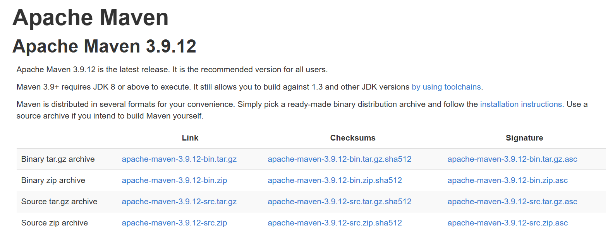
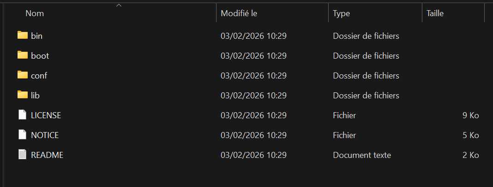
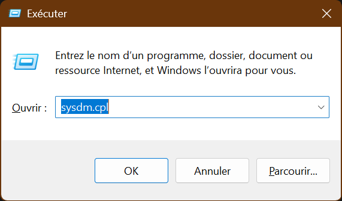
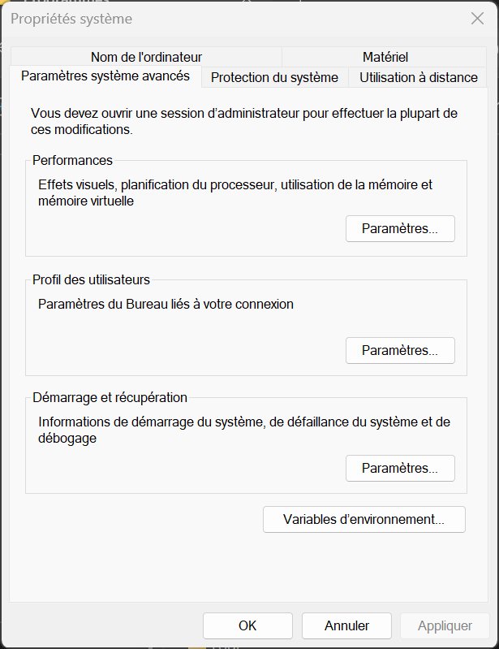
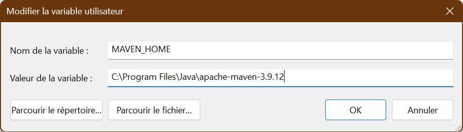
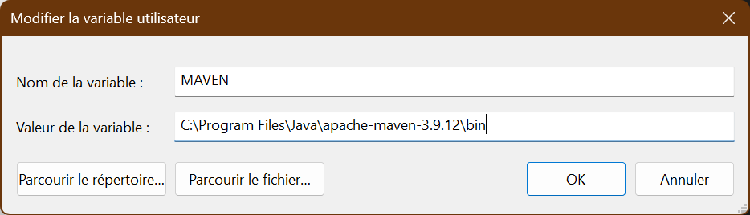
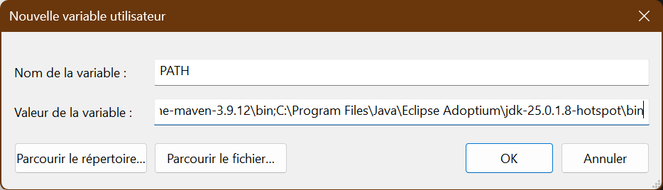
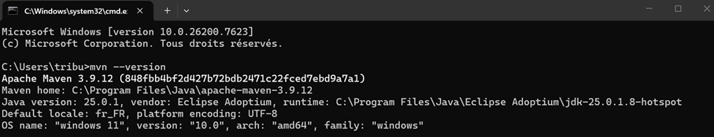
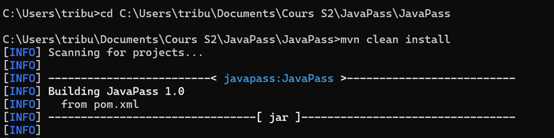

# Tutoriel : Installer et configurer Maven pour JavaPass

## Etape 1

Télécharger et extraire le .zip de Maven dans le répertoire que vous souhaitez.
Lien du téléchargement : https://maven.apache.org/download.cgi

L’intérieur du répertoire Maven ressemble à cela :

## Etape 2

Se rendre dans les propriétés système puis dans les variables d’environnement.

## Etape 3

Ajouter la variable d’environnement utilisateur MAVEN_HOME avec pour valeur le chemin du répertoire apache-maven-3.9.12

## Etape 4

Ajouter aussi la variable d’environnement MAVEN, avec comme valeur le chemin du répertoire apache-maven-3.9.12/bin

## Etape 5
Créer ou modifier la variable d’environnement PATH avec comme valeur le chemin du répertoire apache-maven-3.9.12; et le chemin du répertoire \bin de votre JDK (penser au séparateur ';')

## Etape 6

Pour vérifier que tout est en place, exécuter mvn --version dans un terminal

## Etape 7

Enfin exécuter cd le\chemin\du\répertoire\où\se\trouve\JavaPass, puis mvn clean install

## Etape 8

Profiter pleinement de son Maven configuré !
